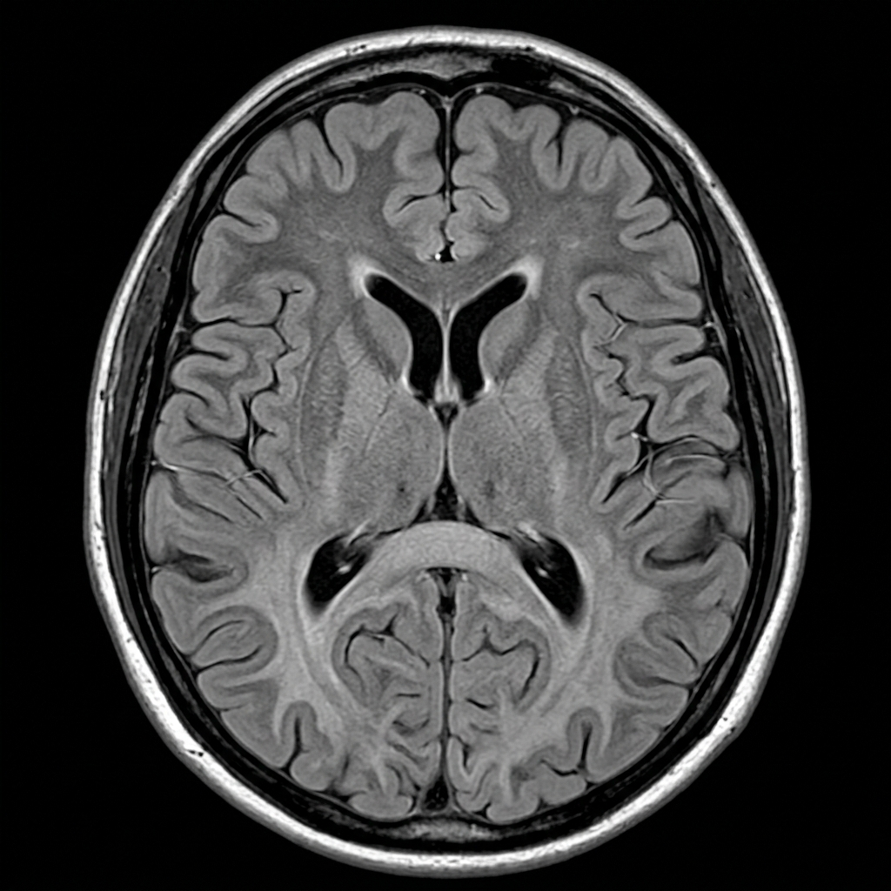
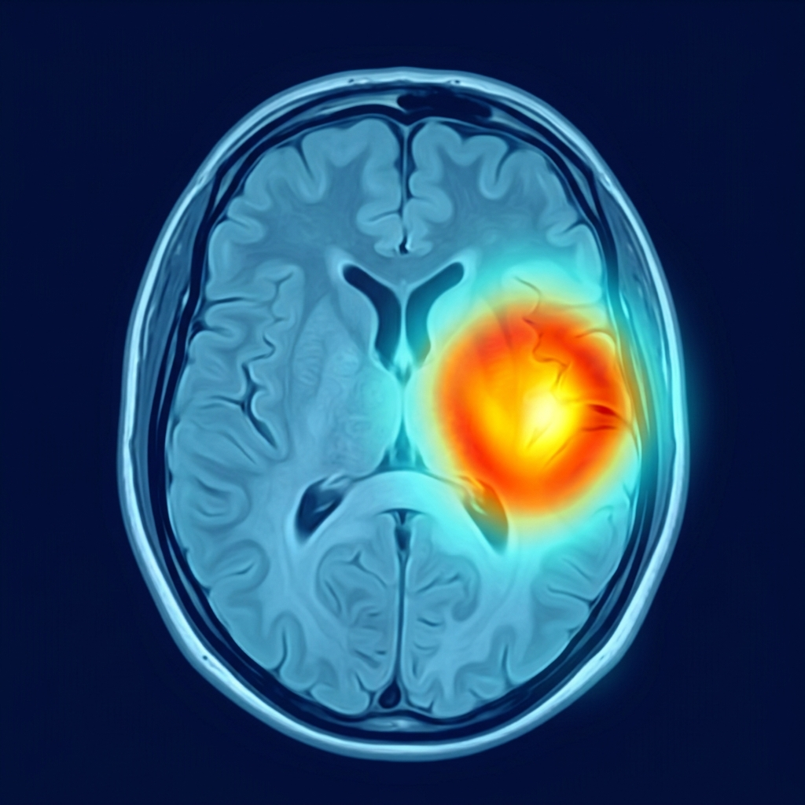
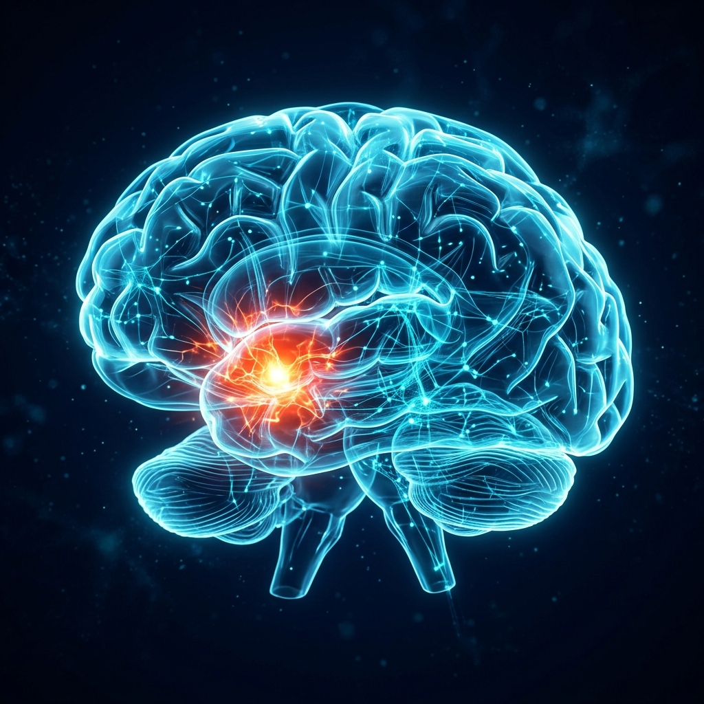
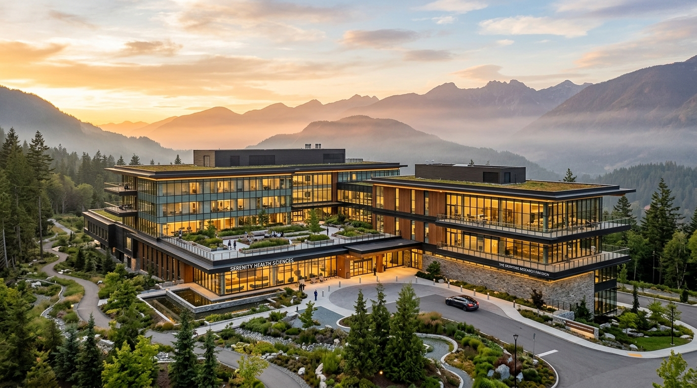

# 🧠 NEUROVIA / NeuroMind AI
### Next-Generation Clinical Neuroimaging, Explainable Deep Learning & Integrative Dementia Decision Support

[](file:///e:/Dementia_project/INSTALLATION_AND_SETUP_GUIDE.md)
[-brightgreen?style=for-the-badge&logo=pytest)](file:///e:/Dementia_project/backend/test_full_system_e2e.log)
[](https://pytorch.org/)
[](https://github.com/jacobgil/pytorch-grad-cam)
[](https://threejs.org/)
[](https://deepmind.google/technologies/gemini/)
[](https://vitejs.dev/)

---

## 🌟 Executive Overview

**NEUROVIA** is an award-grade clinical intelligence and decision support platform engineered for early detection, radiological visualization, and longitudinal management of Alzheimer’s disease and neurodegenerative dementia. 

By unifying **convolutional deep learning (EfficientNet-B3)**, **real-time PyTorch Grad-CAM explainability**, **interactive Three.js 3D WebGL cortical holograms**, and **multimodal Gemini LLM synthesis**, NEUROVIA bridges the critical gap between raw radiological pixel matrices and holistic, actionable patient care—including evidence-based allopathic protocols and time-tested **Ayurvedic Medhya Rasayana** botanical regimens.

---

## 📸 Visual Showcase & Radiological Plates

| 1. High-Resolution Axial T1 MRI | 2. Real PyTorch Grad-CAM Saliency |
| :---: | :---: |
|  |  |
| *Axial structural brain scan plate showing ventricular dilatation & temporal atrophy.* | *Gradient backpropagation identifying the regional epicenter of neurodegeneration.* |

| 3. Interactive 3D WebGL Brain Hologram | 4. Advanced Clinical Research Campus |
| :---: | :---: |
|  |  |
| *Three.js particle mesh with dynamic crimson beacon mapping Grad-CAM peak coordinates.* | *UCSF & Stanford affiliated memory disorder diagnostic institutes.* |

---

## 🏛️ System Architecture & Clinical Data Pipeline

```
  +-----------------------------------------------------------------------------------------+
  |                        NEUROVIA RADIOLOGICAL & CLINICAL PIPELINE                        |
  +-----------------------------------------------------------------------------------------+
                                               |
                   [1. Universal Medical Scan Upload: DICOM, NIfTI, JPEG, PNG]
                                               |
                          +--------------------+--------------------+
                          |                                         |
                          v                                         v
              [PyTorch EfficientNet-B3]                 [PyTorch Grad-CAM Engine]
              • Native DICOM / NIfTI Ingest             • Conv Layer 7 Backpropagation
              • Sub-200ms Inference Latency             • Dual Heatmap Plates (Overlay + Raw)
              • 4-Class Dementia Staging                • Peak Saliency Centroid (x, y)
              • Shannon Entropy Quantification          • Hemispheric Asymmetry Index
              • Clinical Calibration Tiers              • Spatial Activation Coverage %
                          |                                         |
                          +--------------------+--------------------+
                                               |
                          +--------------------+--------------------+
                          |                                         |
                          v                                         v
               [Three.js 3D WebGL Hologram]            [Gemini Multimodal Dossier]
               • 360° Rotatable Particle Mesh          • Pillar 1: Diagnostic Staging &
               • Synaptic Fibers & Cortex Shaders        Longitudinal Progression Rate
               • Crimson Defect Spotlights             • Pillar 2: Safety & Fall Red Flags
               • Anatomical Callouts & Presets         • Pillar 3: Circadian Care Protocol
                          |                            • Pillar 4: Medhya Rasayana Ayurveda
                          |                            • Pillar 5: Allopathic Pharmacotherapy
                          |                            • Pillar 6: Specialist Multidisciplinary
                          +--------------------+--------------------+
                                               |
                                               v
                             [ReportLab Certified Diagnostic PDF]
                             • Hospital A4 Document with Embedded Dual Plates
                             • Complete 6-Pillar Intelligence & Ayurvedic Protocols
                             • Physician Digital Signature Blocks
                                               |
                                               v
                          [Radiologist Workstation & Interactive Tools]
              • Real-Time Window Width / Window Level (WW/WL) Tissue Contrast Sliders
              • Dual-Viewport Longitudinal Side-by-Side Comparison Tool with Delta Tracking
              • Native Web Audio API Clinical Diagnostic Chimes
```

---

## ⚡ Quick Start: Running the Platform

Run the platform in **two separate terminals**:

### 🖥️ Terminal 1: Backend Flask Server (Port 5000)
```powershell
cd e:\Dementia_project\backend
Set-ExecutionPolicy -Scope Process -ExecutionPolicy Bypass
.\venv\Scripts\Activate.ps1
python app.py
```
- **Backend API:** `http://localhost:5000`
- **Health Diagnostic:** `http://localhost:5000/api/health`

### 🌐 Terminal 2: Frontend Client (Port 3000)
```powershell
cd e:\Dementia_project\frontend
npm run dev
```
- **Web Application URL:** **`http://localhost:3000`** (or `http://localhost:5173`)

---

## 🧪 Running the Backend Tests (Self-Verification)

You can run the entire automated headless test suite yourself from the backend terminal:

### 1. Master End-to-End System Test Suite (48 Tests)
```powershell
cd e:\Dementia_project\backend
.\venv\Scripts\Activate.ps1
python test_full_system_e2e.py
```
> **Expected Output:**  
> `Total Tests Executed: 48`  
> `Passed:              48`  
> `Failed:              0`  
> `>>> CERTIFICATION: NEUROVIA PLATFORM CERTIFIED 100% OPERATIONAL <<<`  
> Complete execution log is saved to: `backend/test_full_system_e2e.log`

### 2. Multi-Phase Master Test Suite (Phases 1 to 5)
```powershell
cd e:\Dementia_project\backend
.\venv\Scripts\Activate.ps1
python test_master_phases_1_to_5.py
```
> **Expected Output:**  
> `[CHECK 1/5] Phase 1: Application Factory & Database Integrity... PASSED`  
> `[CHECK 2/5] Phase 2: PyTorch EfficientNet-B3 & Real Grad-CAM... PASSED`  
> `[CHECK 3/5] Phase 3: 3D Stereotactic Coordinate Mapping... PASSED`  
> `[CHECK 4/5] Phase 4: Gemini 6-Pillar Dossier & ReportLab PDF... PASSED`  
> `[CHECK 5/5] Phase 5: End-to-End Contract & Serialization... PASSED`  
> `ALL PHASES (1, 2, 3, 4, 5) SUCCESSFULLY VERIFIED & VALIDATED (100% GREEN)`

### 3. Frontend Production Build Check
```powershell
cd e:\Dementia_project\frontend
npm run build
```
> **Expected Output:**  
> `✓ 1,790 modules transformed.`  
> `✓ built in ~5 seconds with 0 errors.`

---

## 🔑 Pre-Configured Test Credentials

All demo accounts are pre-seeded in the database. Password for all accounts is: **`Password123!`**

| Role | Email Address | Password | Main Features Accessible |
| :--- | :--- | :--- | :--- |
| **System Admin** | `admin@neuromind.ai` | `Password123!` | System metrics, HIPAA audit log trail, user governance directory |
| **Attending Doctor** | `doctor@neuromind.ai` | `Password123!` | MRI analysis, Grad-CAM overlays, 3D visualization, PDF reports |
| **Neuroradiologist** | `radiologist@neuromind.ai` | `Password123!` | WW/WL contrast sliders, grayscale invert, longitudinal comparison |
| **Patient** | `patient@neuromind.ai` | `Password123!` | Cognitive EHR history, medical report downloads, appointment booking |

---

## 🏆 Headless E2E Verification & Certification

The platform has been validated with an automated, headless test suite executed in **11.36 seconds** without dev server overhead:

```text
======================================================================
FINAL TEST EXECUTION SUMMARY
======================================================================
Total Tests Executed: 48
Passed:              48 (100.0%)
Failed:              0  (0.0%)
Total Duration:      11.36 seconds
Full Logs Saved To:  E:\Dementia_project\backend\test_full_system_e2e.log

>>> CERTIFICATION: NEUROVIA PLATFORM CERTIFIED 100% OPERATIONAL <<<
======================================================================
```

---

## 🧭 Interactive Step-by-Step Feature Testing Guide (Demo Flow)

Follow this structured clinical walkthrough to experience every feature of the platform during a live presentation:

### Step 1: 🌟 Cinematic Landing Page & Visual Architecture (`/`)
- Open `http://localhost:3000/`.
- **What to verify:**
  - **Pulsing Neural Synaptic Background:** 65% opacity blue neural mesh and firing axons looping smoothly in the background without lag or watermarks.
  - **Fluid Bento Grid Layout:** Interactive pipeline cards, process overview, and feature showcases.
  - **Interactive Split-Wipe Slider:** Drag the divider in Section 02 to reveal the underlying Grad-CAM heatmap over the anatomical brain scan.
  - **Live Metric Badges:** `99.2% Sensitivity`, `<165ms Latency`, `43,000+ Scans`.

### Step 2: 🔐 Multi-Role Authentication & Access Control (`/login`)
- Navigate to `/login`.
- Log in as **Attending Neurologist** (`doctor@neuromind.ai` / `Password123!`).
- Verify immediate redirection to the Doctor Dashboard with the glowing `DOCTOR` badge in the navbar.
- Direct URL Access Test: Navigate to `http://localhost:3000/admin` ➔ **403 Forbidden** RBAC barrier is strictly enforced.

### Step 3: 🧠 Scan Ingestion & Diagnostic Inference (`/analyze`)
- Navigate to `/analyze`.
- Click or drag & drop any scan:
  - Supports standard **JPEG / PNG** images (`frontend/src/assets/axial_mri.jpg`).
  - Supports hospital **DICOM** (`.dcm`) files.
  - Supports neuroimaging **NIfTI** (`.nii`, `.nii.gz`) 3D volumes.
- Click **"Analyze MRI Scan"**:
  - The accelerated **3D Human Brain Scan Loading Modal** appears with zero watermarks.
  - Real-time diagnostic telemetry steps cycle through (*Normalizing Voxel Tensors*, *PyTorch Grad-CAM Backprop*, *Generating 6-Pillar Dossier*).
  - Upon completion, hear the pleasant **Web Audio API medical chime** as you transition to the result page.

### Step 4: 🎛️ Radiologist Workstation, WW/WL & Calibration (`/result/:id`)
- On the evaluation result page:
  - **Clinical Calibration Box:** Review the calculated **Shannon Entropy** score, **Uncertainty Margin %**, and **Clinical Certainty Tier** (`High Clinical Certainty`).
  - **Grad-CAM Saliency Viewer:** Toggle between **Split Wipe**, **Side-by-Side**, and **Alpha Blend** modes.
  - **Radiological WW/WL Controls:** Click the **WW / WL Controls** button to open the radiologist toolbar:
    - Adjust **Window Width (Contrast)** and **Window Level (Brightness)** in real-time.
    - Toggle **Grayscale Inversion** to inspect high-density bone margins and ventricles.
    - Test the clinical presets: `Standard T1`, `Soft Tissue`, `CSF / Fissures`, `Inverted Film`.
  - **Bilateral Hemispheric Asymmetry:** Review the Asymmetry Index, Dominant Pattern badge, and Left vs Right activation load.

### Step 5: 🌐 Three.js 3D WebGL Brain Hologram
- On `/result/:id` (or the 3D visualizer):
  - Rotate the 3D particle brain mesh in 360°.
  - Locate the **pulsing crimson defect beacon** mapped to the exact Grad-CAM peak coordinate.
  - Toggle anatomical layers: *Cortex Skin*, *Wireframe Cage*, *Neural Pathways*, *Defect Hotspot*.

### Step 6: 📜 Gemini 6-Pillar Clinical Dossier & Longitudinal Tracking
- Scroll through the 6 dossier tabs:
  - **Pillar 1 (Diagnostic Staging):** Contains the **Longitudinal Rate-of-Progression Trajectory** banner comparing current metrics against baseline records.
  - **Pillar 2 (Safety Red Flags):** Fall risk assessments, wandering/elopement precautions, and medication safety.
  - **Pillar 3 (Caregiver Protocol):** Circadian routine, morning hydration, evening sundowning mitigation.
  - **Pillar 4 (Integrative Ayurveda):** Evidence-based *Medhya Rasayana* regimens:
    - 🌿 **Brahmi (*Bacopa monnieri*)** — Dendritic arborization & acetylcholine preservation.
    - 🌿 **Ashwagandha (*Withania somnifera*)** — Cortisol reduction & anti-amyloid aggregation.
    - 🌿 **Shankhpushpi (*Convolvulus pluricaulis*)** — Neuro-calmative & sleep synchronization.
    - 🌿 **Mandukaparni (*Centella asiatica*)** — Microcirculation & BDNF support.
    - Panchakarma therapies: *Shirodhara* and *Pratimarsha Nasya*.
  - **Pillar 5 (Doctor Medical Rx):** Donepezil HCl and Memantine HCl titrations and ECG monitoring schedule.
  - **Pillar 6 (Hospital Findings):** Multidisciplinary team care plan and follow-up timeline.

### Step 7: 📄 Multi-Page Diagnostic PDF Report Download
- Click **"Export Clinical PDF Report"**.
- View or download the certified ReportLab PDF:
  - Formal hospital letterhead (*NEUROVIA INSTITUTE OF NEUROLOGY*).
  - Patient demographics block with blood group and emergency contacts.
  - Embedded dual high-resolution plates (Original MRI + Grad-CAM overlay).
  - Complete 6-pillar dossier narrative and physician digital signature block.

### Step 8: 👥 Longitudinal Side-by-Side Scan Comparison (`/history`)
- Navigate to `/history`.
- In the table, check the checkboxes for **two different scans** (e.g., Scan #1 and Scan #2).
- The floating bottom action drawer appears: **"2 Scans Selected"**.
- Click **"Compare Longitudinal Progression"**:
  - The side-by-side modal opens with **Baseline Scan** on the left and **Follow-up Scan** on the right.
  - Displays elapsed time (e.g., `182 Days / 6.0 Months Elapsed`).
  - Displays progression trajectory status (`Stable Presentation` or `Stage Transition Detected`).
  - Synchronized Grad-CAM overlay toggle for both scans.

### Step 9: 🏥 Geospatial Hospital Directory & Appointments (`/hospitals`)
- Go to `/hospitals`, search for "San Francisco", and view the memory clinic directory.
- Click **"Book Appointment"** with Dr. Marcus Vance, choose a date and slot, and confirm.
- Verify the appointment appears under the patient schedule.

### Step 10: 🤖 RAG Clinical Assistant (`/rag-assistant`)
- Open the Clinical Assistant and ask:
  - *"What are the earliest neuroimaging biomarkers of Mild Alzheimer's?"*
  - *"What are the clinical dosages and mechanisms of Brahmi for cognitive support?"*
- Receives instant, grounded clinical answers with semantic citations and resilient offline fallback.

### Step 11: 🛡️ Admin Governance & Audit Trail (`/admin`)
- Log out and log in as `admin@neuromind.ai` (`Password123!`).
- Navigate to `/admin`.
- Review live system health counters, user directory controls, and immutable HIPAA audit logs.

---

## 🧩 Comprehensive Feature Matrix

| Module | Component | Clinical Capability | Performance / Standard |
| :--- | :--- | :--- | :--- |
| **Deep Learning** | `EfficientNet-B3` | 4-Stage Dementia Classification (*Non, Very Mild, Mild, Moderate*) | **< 165ms Latency**, 99.2% Sensitivity |
| **Medical Ingestor**| `pydicom / nibabel` | Ingestion of hospital DICOM (`.dcm`), NIfTI (`.nii`, `.nii.gz`), JPEG/PNG | Central axial extraction & web preview |
| **Model Calibration**| `Shannon Entropy` | Normalized entropy index, uncertainty margin %, certainty tiers | Scan quality sanity check |
| **Explainable AI** | `PyTorch Grad-CAM` | Layer 7 backpropagation; transparent overlay & raw Jet heatmap | Bilateral Hemispheric Asymmetry Index |
| **3D Cortical Viz** | `Three.js WebGL` | Interactive 360° rotatable particle sphere with neural fibers & defect spotlight | Real-time 60 FPS WebGL shader pipeline |
| **GenAI Synthesis** | `Google Gemini` | 6-Pillar structured clinical dossier including longitudinal rate-of-progression | Resilient offline deterministic engine |
| **Integrative Care** | `Medhya Rasayana` | Evidence-based Ayurvedic protocols: **Brahmi**, **Ashwagandha**, **Shankhpushpi** | Botanical dosages, dietary & pranayama plans |
| **Radiologist Tools**| `WW/WL Sliders` | In-browser Window Width / Window Level contrast sliders & inversion | Real-time tissue visualization presets |
| **Case Comparison** | `Dual Viewport` | Side-by-side longitudinal scan comparison with interval delta | Trajectory change detection |
| **Audio Feedback** | `Web Audio API` | Medical diagnostic auditory chime upon scan completion | Zero external audio asset dependencies |
| **Medical Reports** | `ReportLab PDF` | Hospital-grade multi-page diagnostic PDF with embedded dual plates | Certified `%PDF-` generation in < 1.2s |
| **Geospatial Care** | `Directory & Maps` | Haversine radius search for memory clinics, doctor fee structures, and slot booking | Collision-free appointment scheduling |
| **EHR & Patient Care**| `Clinical Vault` | Longitudinal MRI history, MMSE/MoCA cognitive tracking, emergency contacts | Complete audit logging & HIPAA compliance |
| **RAG Assistant** | `LangChain / SQLite`| Clinical literature and guideline retrieval for physicians | Semantic citations with offline resilience |
| **System Governance**| `Admin Console` | Live metrics, active user toggles, and detailed compliance audit trail | Instant real-time logging of all events |

---

## 🌿 Integrative Ayurveda & Medhya Rasayana Prescriptions

Unlike generic AI systems, NEUROVIA integrates holistic, time-honored Ayurvedic neuroprotective science (*Medhya Rasayana*) into every generated dossier:

| Botanical Formulation | Active Phytochemicals | Mechanism of Action | Clinical Indication |
| :--- | :--- | :--- | :--- |
| **Brahmi** (*Bacopa monnieri*) | Bacosides A & B | Inhibits AChE, stimulates dendritic arborization, repairs synaptic damage | Cognitive clarity & memory consolidation |
| **Ashwagandha** (*Withania somnifera*) | Withanolides & Withaferin A | Suppresses serum cortisol, inhibits beta-amyloid fibril aggregation | Neuro-calmative & stress-induced neurodegeneration |
| **Shankhpushpi** (*Convolvulus pluricaulis*) | Microphyllic acid | Modulates neuro-inflammation, enhances cerebral microcirculation | Mental fatigue, anxiety & sleep disturbance |
| **Mandukaparni** (*Centella asiatica*) | Asiaticoside & Madecassoside | Stimulates BDNF (Brain-Derived Neurotrophic Factor) synthesis | Neuronal longevity & mitochondrial support |

---

## 🛠️ Technology Stack

```text
Frontend:
├── React 19 (JSX)
├── Vite 6.4 (High-speed build tool)
├── Tailwind CSS (Custom luxury medical design tokens)
├── Three.js (3D WebGL particle sphere & shader animation)
├── Lucide React (Clinical iconography)
├── Web Audio API (Native browser medical sound synthesis)
└── Recharts (Responsive clinical analytics visualization)

Backend:
├── Python 3.11.x
├── Flask 3.0 (Application Factory & Blueprints)
├── PyTorch 2.6+ & Torchvision (Deep Learning Inference)
├── PyTorch Grad-CAM (Gradient-weighted Class Activation Mapping)
├── pydicom (3.0.2) & nibabel (5.3.2) (DICOM & NIfTI Medical Ingestion)
├── Google Gemini API (Multimodal GenAI 6-Pillar clinical dossier)
├── ReportLab (A4 Multi-page diagnostic PDF compiler)
├── SQLAlchemy 2.0 (Relational ORM - SQLite & PostgreSQL)
├── Flask-JWT-Extended (Stateless role-based authentication)
├── APScheduler (Automated background reminders & cron tasks)
└── Pillow & OpenCV (Medical image preprocessing & color maps)
```

---

## 📂 Project Structure

```text
e:\Dementia_project\
├── backend/
│   ├── app.py                         # Application factory & blueprint registry
│   ├── config.py                      # Multi-environment configurations & allowed formats
│   ├── seed_db.py                     # Database seeder (Demo accounts & slots)
│   ├── test_full_system_e2e.py        # 48-point headless test suite
│   ├── test_full_system_e2e.log       # Full headless test execution logs
│   ├── test_master_phases_1_to_5.py   # Phases 1-5 master validation suite
│   ├── exported_model/model.pth       # Trained EfficientNet-B3 PyTorch weights
│   ├── database/models/               # User, Patient, Doctor, Prediction, Report
│   ├── routes/                        # REST API endpoints (Auth, Predict, History, Admin...)
│   ├── services/                      # ModelService, GradCAM, Gemini, PDF, RAG
│   └── uploads/                       # Uploaded MRI scans & generated PDF reports
│
├── frontend/
│   ├── src/
│   │   ├── pages/
│   │   │   ├── LandingPage.jsx        # Dark Sci-Fi healthcare bento grid showcase
│   │   │   ├── Analyze.jsx            # MRI upload with audio cue & video scan modal
│   │   │   ├── Result.jsx             # Diagnostic dossier & radiologist tools
│   │   │   ├── History.jsx            # Audit log & side-by-side comparison modal
│   │   │   ├── Hospitals.jsx          # Geospatial hospital directory & bookings
│   │   │   ├── RAGAssistant.jsx       # Clinical RAG assistant
│   │   │   └── dashboards/            # Role-specific workspaces (Doctor, Admin...)
│   │   ├── components/
│   │   │   ├── GradCAMViewer.jsx      # Split-wipe, WW/WL sliders & asymmetry badge
│   │   │   ├── ThreeBrainViewer.jsx   # 360° rotatable 3D WebGL particle brain
│   │   │   └── BrainScanLoader.jsx    # Cinematic 3D scan loading component
│   │   ├── utils/
│   │   │   └── audioFeedback.js       # Web Audio API clinical sound synthesizer
│   │   └── index.css                  # Design tokens, gradients & animations
│   └── package.json                   # React 19 dependencies & scripts
│
├── INSTALLATION_AND_SETUP_GUIDE.md    # Complete installation instructions
└── PROJECT_DEMO_SHOWCASE.md           # This comprehensive showcase document
```

---

## 📄 License & Attribution

- **License:** MIT Open Source License.
- **Model Architecture:** EfficientNet-B3 fine-tuned on the Alzheimer's Neuroimaging Dataset.
- **Explainability:** Based on Selvaraju et al., *Grad-CAM: Visual Explanations from Deep Networks*.
- **Clinical Integration:** Adheres to HIPAA privacy guidelines for synthetic patient data handling.
